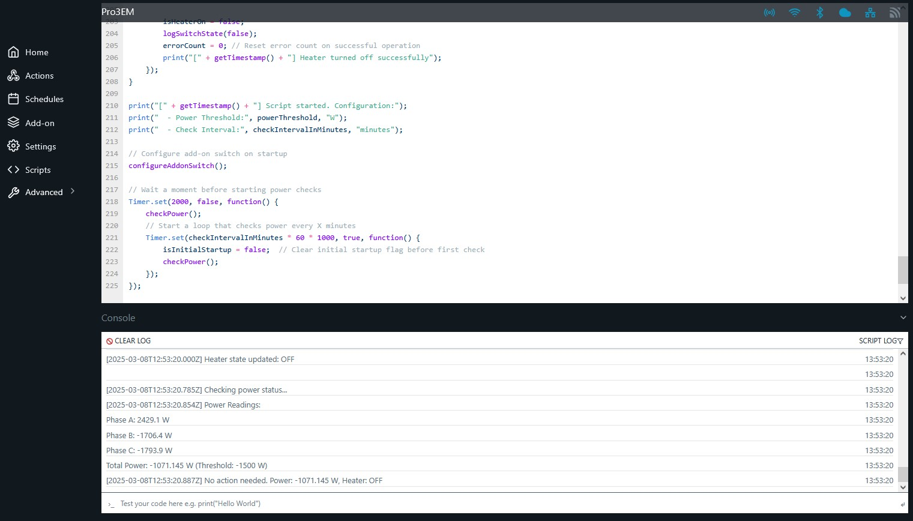

# Shelly Pro 3EM Power-Based Switch Control

This script was created when upgrading a solar power plant from 5kWp to 11.75kWp. The new inverter did not include built-in power management for controlling devices based on power export. In my scenario it was a water heating device. As a solution, a Shelly Pro 3EM device with Pro Output Addon and power contactor (German: Lastschütz) was installed to safely switch devices based on power export measurements.

This script controls the switch through the Shelly Pro 3EM device based on power export measurements, ensuring that excess solar power is efficiently used instead of being exported to the grid.

## Documentation Links

- [Shelly Pro 3EM API Documentation](https://shelly-api-docs.shelly.cloud/gen2/)
- [Shelly Pro Output Addon Documentation](https://shelly-api-docs.shelly.cloud/gen2/Addons/ShellyProOutputAddon)

## Live View



The screenshot above shows the script running in the Shelly web interface. The interface is split into two main sections:
- Top: Script editor showing the code with syntax highlighting
- Bottom: Live console output showing real-time power readings, switch states, and script actions

In this example, you can see the script monitoring three-phase power measurements and making decisions based on the total power export/import values.

## Features

- Monitors three-phase power measurements
- Automatically controls switch based on power export
- Configurable power threshold
- Time-based operation restrictions
- Error handling with automatic safety shutdown
- Detailed logging

## Requirements

### Hardware
- Shelly Pro 3EM device
- Pro Output Addon installed and enabled
- Device connected to the addon switch
- Network connectivity between devices

### Software
- Shelly firmware version supporting Scripts (tested with 1.0.7)
- Pro Output Addon enabled in device settings

## Configuration

```javascript
let powerThreshold = -1500;           // Power threshold for excess energy (negative = export)
let checkIntervalInMinutes = 5;       // Check interval in minutes (default: 5)
let useOffTimes = true;               // Whether to use time restrictions (default: true)
let offTimeHourStart = 20;            // Hour when switch should stop (24h format, default: 20 = 8 PM)
let offTimeHourEnd = 6;               // Hour when switch can start again (24h format, default: 6 = 6 AM)
```

## Operation

### Power Control
- Switch turns ON when power export exceeds 1500W (power < -1500W)
- Switch turns OFF when power import occurs (power >= 0W)

### Time Restrictions
Two modes available:

1. Time-restricted operation (default):
   - By default, switch only operates between 06:00 and 20:00
   - Configurable through `offTimeHourStart` and `offTimeHourEnd`

2. Unrestricted operation:
   - Set `useOffTimes = false`
   - Switch can operate at any time based on power threshold

### Error Handling
- Tracks consecutive errors
- Automatically turns off switch after 3 consecutive errors
- Detailed error logging
- Error count reset after successful operations

## Installation

1. Upload script to Shelly device
2. Enable script in Shelly web interface
3. Turn the switch on when excess power is available
4. Turn the switch off when:
   - Power import occurs
   - Outside allowed hours
   - Too many errors occur

## Logging

The script provides detailed logging of:
- Power measurements for all phases
- Switch state changes
- Error conditions
- Time restriction checks

## License

MIT License - Feel free to use and modify as needed. 